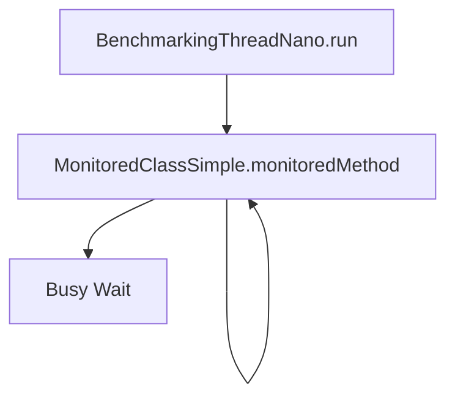
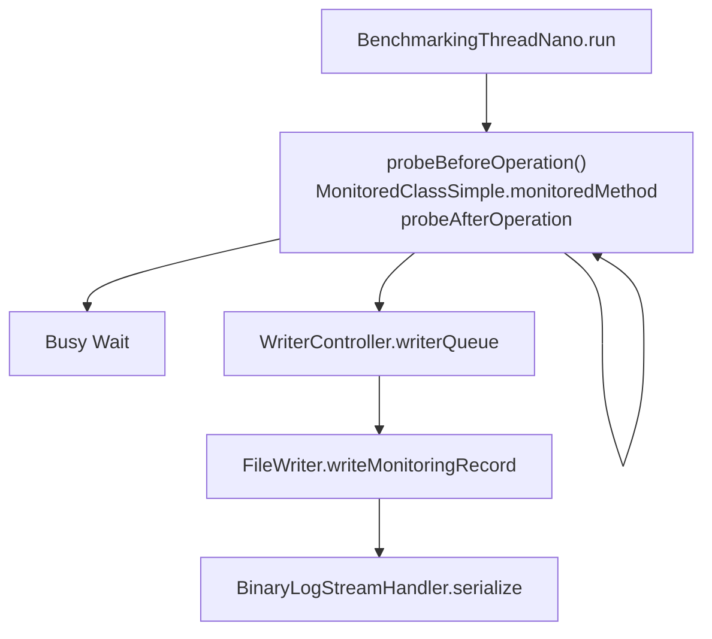

# The MooBench Monitoring Overhead Micro-Benchmark 

The MooBench micro-benchmarks can be used to quantify the performance overhead caused by monitoring framework components and different monitoring frameworks. 

Continuous measurement results are available here:
* Kiel University Server (Intel Xeon CPU E5620 @ 2.40 GHz, Debian 12): https://kieker-monitoring.net/performance-benchmarks/
* GH Actions Runner (Ubuntu 22.04[^1]): https://kieker-monitoring.github.io/moobench/dev/bench/

[^1]: According to https://docs.github.com/de/actions/using-github-hosted-runners/about-github-hosted-runners/about-github-hosted-runners

Currenly (fully) supported monitoring frameworks are:
* Kieker with Java (http://kieker-monitoring.net)
* OpenTelemetry with Java (https://opentelemetry.io/)
* inspectIT with Java (https://inspectit.rocks/)
For all combinations of supported monitoring frameworks $FRAMEWORK and languages $LANGUAGE, the folder frameworks contains a folder $FRAMEWORK-$LANGUAGE.

## Approach

MooBenchs measures the overhead of monitoring by executing an example workload using different monitoring configurations, including *no instrumentation* (and hence no monitoring) at all, and full monitoring and data serialization via *binary writer*. The example workload consists of `$RECURSION_DEPTH` recursive calls of a function to itself. For example, the following graph shows the execution of MooBench in the *no instrumentation* configuration:



The *binary writer* configuration on the other hand includes the probe code, that is injected by the monitoring tool before and after the operation. For the Kieker monitoring framework, the probe inserts records into the `WriterController.writerQueue`, and these are passed to the 



## Directory Structure

- analysis = analysis scripts
- benchmark = moobench code
- continuous-integration = obsolete
- docker = Dockerfile to be used in automated runs on our intrestructure
- frameworks = benchmark setups for the different frameworks for the respective language
  - Kieker-java
  - Kieker-python
  - OpenTelementry-java
  - SPASSmeter (currently not maintained)
  - inspectIT-java
- gradle = build system, gradle libraries
- tools = tooling used to support benchmarks and process results
  - compile-results = adds new results to a result log and computes partial
    views of the results for presentation in websites
  - getConfidenceIntervalTable = compute the confidence interval table
  - receiver = receiver for Kieker TCP probe output

## Benchmark Execution

Initially, the following steps are required:
1. Make sure, that you've installed R (http://www.r-project.org/) to generate
   the results , awk to install intermediate results and curl to download
   processing tools (Ubuntu: `sudo apt install r-base gawk curl`).
2. Compile the application and install it in the repository root directory.
   This can be done automatically be calling
   `./setup.sh`

All experiments are started with the provided "External Controller" scripts.
The following scripts are available for every supported framework ($FRAMEWORK) and language ($LANGUAGE):
* In `frameworks/$FRAMEWORK-$LANGUAGE/benchmark.sh` a script is provided for regular
  execution (with default parameters)
* In `frameworks/$FRAMEWORK-$LANGUAGE/runExponentialSizes.sh` a script is provided for
  execution with different call tree depth sizes (exponentially growing from 2)

Each scripts will start different factorial experiments (started `$NUM_OF_LOOPS`
times for repeatability), which will be:
- baseline execution
- execution with instrumentation but without processing or serialization
- execution with serialization to hard disc (currently not available for
  inspectIT)
- execution with serialization to tcp receiver, which might be a simple receiver
  (Kieker), or Zikpin and Prometheus (OpenTelemetry and inspectIT)

All scripts have been tested on Ubuntu and Raspbian. 

The execution may be parameterized by the following environment variables:
* SLEEP_TIME           between executions (default 30 seconds)
* NUM_OF_LOOPS         number of repetitions (default 10)
* THREADS              concurrent benchmarking threads (default 1)
* RECURSION_DEPTH      recursion up to this depth (default 10)
* TOTAL_NUM_OF_CALLS   the duration of the benchmark (deafult 2,000,000 calls)
* METHOD_TIME          the time per monitored call (default 0 ns or 500 us)

If they are unset, the values are set via `frameworks/common-function.sh`.

Typical call (using Ubuntu):
```
export SLEEP_TIME=1 
./gradlew assemble 
cd frameworks/OpenTelemetry-java/
./benchmark.sh
```

## Data Analysis

Each benchmark execution calls an R script providing mean, standard deviation
and confidence intervals for the benchmark variants. If you want to get these
values again, switch to `frameworks` and call `runR.sh $FRAMEWORK`, where
framework is the folder name of the framework (e.g. Kieker).

If you got data from a run with exponential growing call tree depth, unzip them
first (`for file in *.zip; do unzip $file; done`), copy all `results-$framework`
folder to a common folder and run `./getExponential.sh` in analysis. This will
create a graph for each framework and an overview graph for external processing
of the traces (zipkin for OpenTelemetry and inspectIT, TCP for Kieker).

In the folder /bin/r are some R scripts provided to generate graphs to visualize
the results. In the top the files, one can configure the required paths and the
configuration used to analyze the data.

## Quality Control

We also use MooBench as a performance regression test which is run periodically
when new features are added to Kieker.

